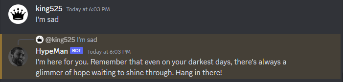

# HypeMan

 A discord bot named hype man. It encourages you anytime it hears a you say a sad or demotivationg comment.

## Common Keywords 
- Sad
- Angry
- Frustrated
- Bad
- Depressed
- Lonely
- Unhappy

## Functions
- **$inspire** : Sends an inpiring quote. Syntax: `$inspire`
- **$new** : Adds a new possible response to its database. Syntax: `$new *<Your New Reply>*`.
- **$del** : Remove a possible response to its database. Syntax: `$del *<The Index of the Reply>*`.
- **$respond** : Toggle if the bot should reply to sad comments or not. Syntax: `$respond *<True/False>*`.
- **$list** : Sends a list of all the possible encouragements. Syntax: `$list`.

## [Click Here to Add HypeMan to your Discord Server](https://discord.com/api/oauth2/authorize?client_id=1122503938898407556&permissions=0&scope=bot)